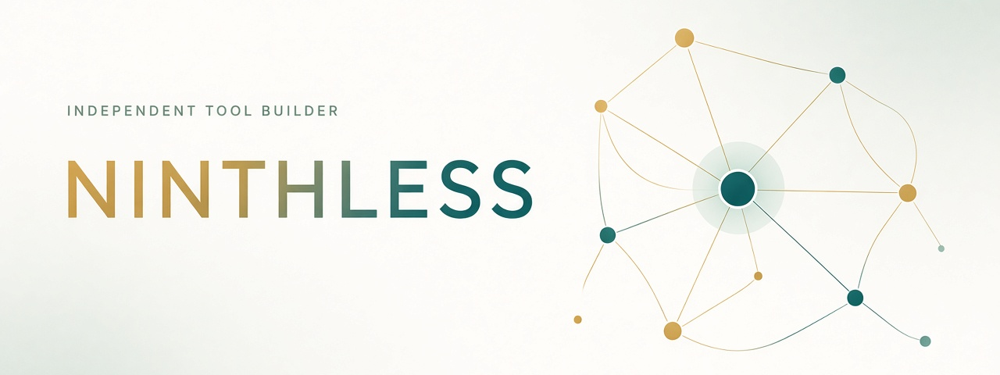

  <picture>
    <source media="(prefers-color-scheme: dark)" srcset="./assets/hero-dark.png">
    <source media="(prefers-color-scheme: light)" srcset="./assets/hero-light.png">
    
  </picture>

  <a href="https://github.com/Ninthless/StackFerry"><strong>StackFerry</strong></a>
  &nbsp;·&nbsp;
  <a href="https://github.com/Ninthless?tab=repositories">All projects</a>
  &nbsp;·&nbsp;
  <a href="https://github.com/Ninthless/agent-skills">Agent skills</a>

 

## Selected builds

### [StackFerry](https://github.com/Ninthless/StackFerry)

**A focused desktop provider manager and router for AI coding tools.**

One place to manage providers, credentials, model routing, and tool-specific configuration across coding agents. Built as a native-feeling desktop product with **Rust**, **Tauri**, and a deliberately small operational surface.

`AI infrastructure` &nbsp; `Rust` &nbsp; `Tauri` &nbsp; `BYOK` &nbsp; `LLM routing`

 

<table>
  <tr>
    <td width="50%" valign="top">
      <h3><a href="https://github.com/Ninthless/agent-skills">agent-skills</a></h3>
      
A maintained collection of reusable skills for coding agents, covering research, engineering workflows, delivery constraints, and automation.

      
<code>Agents</code> <code>Python</code> <code>Automation</code>

    </td>
    <td width="50%" valign="top">
      <h3><a href="https://github.com/Ninthless/ACEOptimizer">ACEOptimizer</a></h3>
      
A lightweight Windows utility for reducing ACE anti-cheat CPU pressure through controlled process priority and affinity management.

      
<code>C#</code> <code>WPF</code> <code>Windows</code>

    </td>
  </tr>
</table>

 

## Current focus

**01 / AI coding infrastructure** 
Provider routing, reusable agent capabilities, and tools that make coding assistants easier to operate.

**02 / Desktop engineering** 
Focused, native-feeling software built with Rust, Tauri, .NET, Electron, and platform APIs.

**03 / Practical automation** 
Small systems shaped around real workflow friction instead of speculative feature lists.

 

## Working range

`Rust` `TypeScript` `Python` `C#` `Java` `Kotlin` `React` `Vue` `Tauri` `Electron` `WPF` `FastAPI` `Spring Boot` `Docker`

 

> Most of my projects begin with the same question: why is this workflow still harder than it needs to be?

  <a href="https://github.com/Ninthless?tab=repositories">Explore the work →</a>

